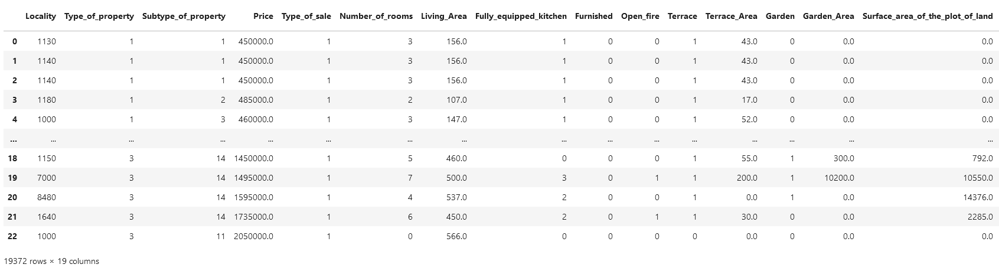

# real-estate-price-prediction

In this project, we aim to predict house prices using various features such as location, number of rooms, living area etc.

The project is divided into three main parts: data collecting, data analysis and model building. It includes several notebooks that explain each step of the process in detail. Additionally you can find a requirements document with the installation process and a timeline at the end of this readme. Happy coding! 

# Part I: Collecting data

## Description Part I
The goal of this project was to collect information from the [immoweb website](https://www.immoweb.be/en/search/house/for-sale?countries=BE&page=1&orderBy=relevance). We had to gather information about at least 10,000 properties all over Belgium and create a CSV file with the following columns.

* __Locality__, __Type of property__, __Subtype of property__, __Price__, __Type of sale__, __Number of rooms__, __Living Area__, __Fully equipped kitchen__, __Furnished__, __Open fire__, __Terrace__, __Terrace_Area__, __Garden__, __Garden_Area__, __Surface of the land__, __Surface area of the plot of land__, __Number of facades__, __Swimming pool__, __State of the building__.

The dataset had to be clean in the sense of recording only numerical values. 

This code for this part consists of three different parts: 
### 1) Collecting the links
The aim of the [links_collection.ipynb](./data_acquisition/links_collection.ipynb) file is to collect the links of all houses and apartment for sale on the immoweb website. In practice, the house and apartment sections are done in parallel (using threads) and both are following the same algorithm:
* __first__, The algorithm goes through the 333 pages that are available:
* __then__, scrapes these pages to get all the links it contains
* __lastly__, This part creates a csv file called [links.csv](./data_acquisition/links.csv) which stores all the links collected.

__Usage__: This process takes up to 1 hour. Remember to change the number of pages manually.

### 2) Scraping all the links
For all the links that are stored in the links.csv file, [house_scrapping.ipynb](./data_acquisition/house_scrapping.ipynb) will:
* open the link
* scrape the available information
* store all the collected information into different csv files called all_info_TeamMember1_1-5000.csv, all_info_TeamMember1_1-10000.csv, all_info_TeamMember2_10000-15000.csv, etc. These files will be merged in the next step of the program. 

In this csv file, each line represents a new house/apartment. The column names are given in the Description section. In this part a special type of multithreading was implemented, which is called teamwork: 
- pip install nicePeople
- from nicePeople import teamwork 

We have splitted the links (20000 in total) in three to collect the information in parallel. The reason for this was to minimize the risk of being blocked by the immoweb website if we'd have used 'real' concurrency. 

__Usage__: This (shared) workprocess can take up to 4 hours when divided between two or more computers. When there's a problem while running, the code will store the scraped information under a CSV file. 

### 3) Cleaning the data

In this last part [merge_and_clean_data.ipynb](./data_acquisition/merge_and_clean_data.ipynb) we will merge all the csv files from the previous part. The dataframe is not clean yet. We only want to retrieve numerical values. So this part of code will include a mapping. 

#### Output part I
After cleaning the data, the dataframe looks as follows:

--

# Part II: Analysing data

## Description Part II

In this part of the project, we'll analyse the dataset in three stages. Initially, we will review and clean the dataset as necessary (Stage 1). Next, we will conduct an analysis of the data (Stage 2), and finally, we will interpret the results based on the two scenarios and additional questions specified in this project (Stage 3). We will only provide a summary of the answers and visualizations in this README, however, a more detailed explanation and output can be found in [data_visualization.ipynb](./data_visualization/data_visualization.ipynb).

### Step 1: Cleaning the data 

A cleaned dataset is one that is free of duplicates, blank spaces, and errors. With this in mind, we have conducted an analysis. An initial review of our dataset revealed that certain columns and rows could be removed. It is also recommended to verify the data types for each column and make adjustments as necessary.

### Step 2 : Analysing the data

Now that the data has been collected and cleaned, it is time for the analysis. In this part we have formulated an answer to the following questions: 

- How many rows and columns are left in our dataframe. 
- How many qualitative and quantitative variables are there?
- What the correlation between the variables.
- Which variables have the greatest/lowest influence on the price?
- What is the percentage of missing values per column?

### Step 3 : Data Interpretation

In this section, we will conduct a deeper analysis of the data by addressing the questions in (3.1) as part of this challenge and by using our own case study (3.2). After completing the analysis, we will interpret the results and present the findings. 

#### 3.1: Questions
- Plot the outliers.  
- Represent the number of properties according to their surface using a histogram.
- What are the **most/less** expensive municipalities in Belgium/Wallonia/Flanders? (Average price, median price, price per square meter)

We have also linked postal codes with the corresponding region and province to answer the questions in the casestudy below. 

#### 3.2: Case 

As part of the project, we were tasked with providing valuable insights about the dataset. We have therefore focused on two questions for the following clients:

- Client 1 is an apartment builder from Wallonia who is constructing apartment buildings and selling each unit. The builder is uncertain about whether to include an American-style kitchen in the units and if this will affect the house prices.
- Client 2 is an investor from Flanders who is interested in purchasing properties that need restoration. He is curious about which provinces would provide a higher profit margin after renovation.

# Part III: Machine Learning Model 

## Description Part III

The clients were pleased with the analysis we provided last week, and have asked us to create a machine learning model to predict real estate prices in Belgium. We will be using the same dataset that was previously scraped from immoweb. We will be following these three steps:

- Step 1: Data cleaning and preprocessing:
	- We will ensure that we are working with a clean dataset and preprocess the data. We have added an additional column for provinces and changed the column 'fully_equipped_kitchen' to a True or False value.
- Step 2: Model selection and training:
	- We will format the data for machine learning by dividing our dataset for training and testing.
	- We have chosen to use the Random Forest regression model, with features such as 'Postal_code', 'Subtype_of_property', 'Price', 'Number_of_rooms', 'Living_Area','Terrace_Area', 'Garden_Area','Surface_area_of_the_plot_of_land', State_of_the_building' and the target being 'Price'.
- Step 3: Model evaluation:
	- We have achieved an accuracy of 75% with our model, by testing different models and making adjustments to the preprocessed data and features. This step includes functions and graphs to evaluate the model. We will repeat these steps multiple times to improve the accuracy of the model, noting that preprocessing the data will take the most time.

Each step is explained in more detail in the notebook [model_training.ipynb](./model_training/model_training.ipynb). 

__Usage__: It is necessary to repeat steps 1-3 multiple times in order to achieve an optimal accuracy outcome. Keep in mind that the majority of the time will be spent on preprocessing the data.

# Part IV: API Deployment

## Description Part IV

This API is hosted on [immoprediction.onrender.com](https://immoprediction.onrender.com) and uses a Random Forest Regression model to predict the price of a house or apartment based on the inputs given.

## Routes
The following routes are available for this API:
- `/` and `/home` with GET method: This route is used to access the home page of the API.
- `/prediction` with GET method: This route is used to access the form to input the details of a house to get its predicted price.
- `/logout` with GET method: This route is used to logout from the API.
- `/submit` with POST method: This route is used to submit the details of a house and receive its predicted price as a JSON response.

## Input
The data expected in the form on the `/prediction` route is:
- Postal code (mandatory, integer)
- Subtype of property (mandatory, integer)
- Number of rooms (mandatory, integer)
- Living area (mandatory, integer)
- Terrace area (mandatory, integer)
- Garden area (mandatory, integer)
- Surface area of the plot of land (mandatory, integer)
- State of the building (mandatory, integer)

## Output
The output of the `/submit` route in case of success is a JSON response with two fields:
- `prediction`: The predicted price of the house
- `status_code`: HTTP status code (200)

In case of error, an appropriate error message and status code will be returned.

# Future work 

There is always opportunity for enhancement! In a future project, we will make the following improvements.

Part I. Collecting the data

- Adding an additional variable 'end_pagenumber' such that users won't have to change this number manually when scraping the links. 

Part II. Analysing data

- Adding colours to graphs. 
- Making more use of seaborn library as it has easier commands to read.

Part III. Machine Learning

- Trying different approach on datapreprocess in order to get better accuracy. 
- Tying different approaches to handle the missing values in our columns. 
- Trying several other models which we couldn't implement now. 

Part IV. API Deployment µ

- Collecting and returning data in jSON format 
- Including maybe the range of the price prediction as we know that there's a mean error value. 

General: 

- Formatting the code with library black

# Timeline and contributors

* I. Collecting the data: 4 days (teamwork: Sacha, Sébastien and Naci)
* II. Analysing data: 3 days (Naci)
* III. Machine Learning: 4 days (Naci)
