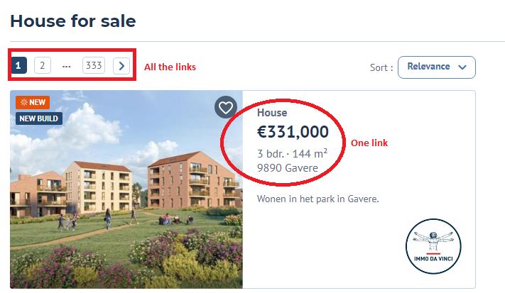

# real-estate-price-prediction

## Description
The goal of this project was to collect information from the [immoweb website](https://www.immoweb.be/en/search/house/for-sale?countries=BE&page=1&orderBy=relevance). We had to gather information about at least 10,000 properties all over Belgium and create a CSV file with the following columns.
* __Locality__
* __Type of property__ (House/apartment)
* __Subtype of property__ (Bungalow, Chalet, Mansion, ...)
* __Price__
* __Type of sale__ (Exclusion of life sales)
* __Number of rooms__
* __Living Area__
* __Fully equipped kitchen__ (Yes/No)
* __Furnished__ (Yes/No)
* __Open fire__ (Yes/No)
* __Terrace__ (Yes/No)
 -If yes: Area
* __Garden__ (Yes/No)
 -If yes: Area
* __Surface of the land__ (is none for each line, the information is given in the line : Surface area of the plot of land)
* __Surface area of the plot of land__ 
* __Number of facades__
* __Swimming pool__ (Yes/No)
* __State of the building__ (New, to be renovated, ...)

The dataset had to be clean in the sense of recording only numerical values. 

## Installation

The following packages were useful in order to make the project work: 

- json (built-in); 
    - This library provides a representation of the JavaScript Object Notation (JSON) with support for parsing, printing, and manipulating JSON values. 
- pandas (pip install pandas);
    - This library offers data structure and operations for data analysis and manipulation.
- bs4 (pip install bs4);
    - BeautifulSoup is a library for getting data out of XML and HTML files. The library's folder is bs4. 
- selenium (pip install selenium);
    - This library is useful when getting the content of dynamic web pages which rely on Javascript. It is useful when information is accessible by clicking on buttons. 
- threading.
    - This module can be used to execute tasks concurrently. 
- matplotlib

## Structure of the code

Our program consists of three different parts. The first part of the program is responsible for gathering all the necessary links that will be used for data collection. The second part of the program uses the collected links to scrape information from those webpages. The final step of the program is to "clean" the data that has been collected. This includes removing duplicates and formatting data to have (mainly) numerical values. However, the data is not processed to remove any errors or inconsistencies. 

### 1) Collecting the links
The aim of the [links_collection.ipynb](./data_acquisition/links_collection.ipynb) file is to collect the links of all houses and apartment for sale on the immoweb website. In practice, the house and apartment sections are done in parallel (using threads) and both are following the same algorithm:
* __first__, The algorithm goes through the 333 pages that are available:
* __then__, scrapes these pages to get all the links it contains
* 
* __lastly__, This part creates a csv file called [links.csv](./data_acquisition/links.csv) which stores all the links collected.

### 2) Scraping all the links
For all the links that are stored in the links.csv file, [house_scrapping.ipynb](./data_acquisition/house_scrapping.ipynb) will:
* open the link
* scrape the available information
* 
* store all the collected information into different csv files called all_info_TeamMember1_1-5000.csv, all_info_TeamMember1_1-10000.csv, all_info_TeamMember2_10000-15000.csv, etc. These files will be merged in the next step of the program. 

In this csv file, each line represents a new house/apartment. The column names are given in the Description section. In this part a special type of multithreading was implemented, which is called teamwork: 
- pip install nicePeople
- from nicePeople import teamwork 

 We have splitted the links (20000 in total) in three to collect the information in parallel. The reason for this was to minimize the risk of being blocked by the immoweb website if we'd have used 'real' concurrency. 

### 3) Cleaning the data

In this last part [merge_and_clean_data.ipynb](./data_acquisition/merge_and_clean_data.ipynb) we will merge all the csv files from the previous part. The dataframe is not clean yet. We only want to retrieve numerical values. So this part of code will include a mapping which is explained in the 'usage' of this 'readme' file.

## Usage

### 1) Collecting the data 
You can use any WebDriver through Selenium to get and extract the URL of each page. The Firefox WebDriver was used in this project with an additional option (headless) which doesn't show the process of opening and closing the pages. 

In order to collect the links of all houses and apartments for sale, we had a look on the website of immoweb and found 333 pages for each property type. This is something you need to check and change manually when running the program. You can also add an additional variable 'end_pagenumber' and scrape this information from the website. 

This workprocess will take about 1 hour. 

### 2) Scraping all the links

To scrape each propertylink we have parsed the HTML website using BeautifulSoup library. We saw that the information was under a "script" with type "text/javascript" and that property items could be found in "window_classified".

We converted the needed information into a Python dictionary using JSON. 

This (shared) workprocess can take up to 4 hours when divided between two or more computers. When there's a problem while running, the code will store the scraped information under a CSV file. The program will continue working with a new CSV file. You can add your name to distinguish between team members.

This will of course cause an additional task to merge all the CSV files. The [merge_and_clean_data.ipynb](./data_acquisition/merge_and_clean_data.ipynb) will execute this for you. 

### 3) Cleaning the data

The function 'create_df' will merge all the csv files into a single dataframe. This dataframe will have non-numerical values. In order to get only numerical values we have written the function clean_df. This part of the code will replace string values by numerical values (using mapping). 

## Visuals
In this part we would like to illustrate some visuals about the output of this program. After cleaning the data, the dataframe looks as follows:

Here we can see that the dataframe consists only of numerical values like required. We can see that the data is (almost) evenly distributed between the two property types (house/apartment) as we see from the pie chart below:

We did also check the range of price across all the properties and the boxplot (below) looks quite normal. 

--
